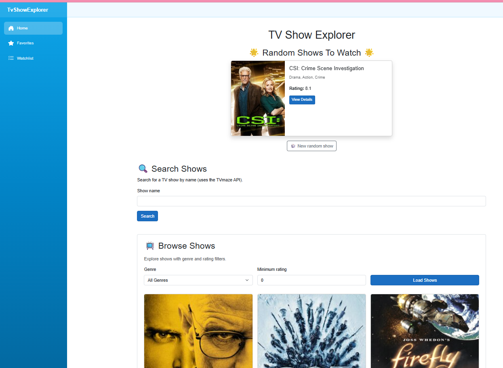
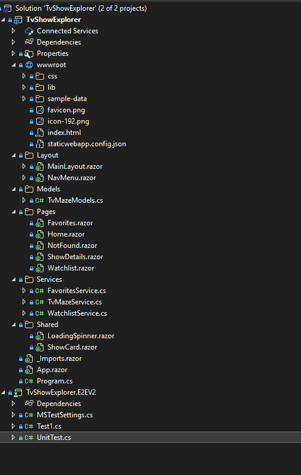
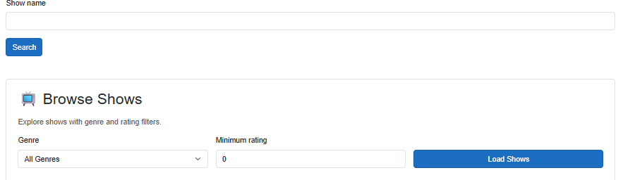

# TV Show Explorer (Blazor WebAssembly)

Small Blazor WebAssembly app for exploring TV shows via the TVMaze API. Supports search with validation/filtering, a random “show of the day,” browsing, and managing favorites/watchlist (stored in `localStorage`). Includes Playwright end-to-end tests.

Live app: https://gray-plant-018db4303.3.azurestaticapps.net/

## Quick start
1) Prereq: .NET 8 SDK.
2) Restore/build/run (from repo root):
   ```bash
   dotnet run --project TvShowExplorer\TvShowExplorer\TvShowExplorer\TvShowExplorer\TvShowExplorer.csproj
   ```
   - Default URLs come from `launchSettings.json` (`https://localhost:7033`). Use `--urls` to pick another.
3) Open the shown URL in the browser (accept the dev cert if using HTTPS).


## Project layout
- `TvShowExplorer/TvShowExplorer/TvShowExplorer/TvShowExplorer` — Blazor WASM app
  - `Pages/` Home, ShowDetails, Favorites, Watchlist, NotFound
  - `Services/` TvMazeService (API), FavoritesService, WatchlistService (both use `localStorage`)
  - `Models/` TVMaze DTOs (nullable where the API may omit fields)
  - `Shared/` ShowCard, LoadingSpinner
  - `Layout/` MainLayout, NavMenu
  - `wwwroot/` static assets/config
- `TvShowExplorer/TvShowExplorer/TvShowExplorer/TvShowExplorer.E2EV2` — Playwright MSTest E2E tests


## Features
- Random “Show of the Day” from TVMaze.
- Search with data-annotation validation, min-rating filter, and sort (rating/name).
- Browse with genre and rating filters.
- Show details with episodes by season; toggle favorites and watchlist.
- Favorites/Watchlist pages showing saved shows; empty-state messaging.

## Configuration
- `Program.cs` sets the API base address: `https://api.tvmaze.com`.
- E2E tests target the deployed site by default: update `BaseUrl` in `TvShowExplorer.E2EV2/UnitTest.cs` if you want to point them at a different host.

## Testing (Playwright E2E)
Run from repo root:
```bash
dotnet test TvShowExplorer\TvShowExplorer\TvShowExplorer\TvShowExplorer.E2EV2\TvShowExplorer.E2EV2.csproj
```
- First run may download browsers automatically; if not, run `pwsh bin\Debug\net10.0\playwright.ps1 install` from the E2E project directory.
- Tests cover: search success, search validation, no-results message, and browse load.

## Publish / deploy
Produce static output:
```bash
dotnet publish TvShowExplorer\TvShowExplorer\TvShowExplorer\TvShowExplorer\TvShowExplorer.csproj -c Release -o publish-out
```
Deploy the contents of `publish-out\wwwroot` (Azure Static Web Apps workflow is included in `.github/workflows/azure-static-web-apps-gray-plant-018db4303.yml`).
